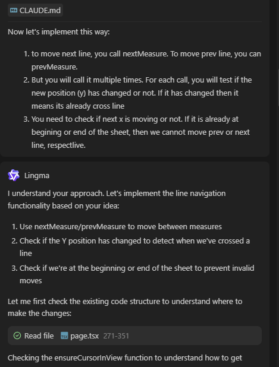

### **第十天：扩展输入方式与导航优化——在“能做什么”与“暂时做不到什么”之间权衡**

经过前九天的开发，应用的核心功能已经相当完整。第十天，我将目标转向了两个方面：**扩展乐谱的来源输入方式**，以及**优化在乐谱内部的导航体验**。这两项工作再次凸显了在与AI协作中，明确技术边界和调整实现策略的重要性。

**目标一：从图片到乐谱——集成光学识别引擎**

为了让应用能直接“读懂”手机拍摄的纸质乐谱或图片，我提出了“拍照识谱”（光学乐谱识别，OMR）的需求。这是一个典型的、需要引入外部专业工具的任务。

1.  **技术选型**：通过沟通，AI助手快速锁定了GitHub上的开源项目 **Audiveris**。这是一个基于Java开发的成熟OMR工具，其命令行模式能够将乐谱图片直接转换为 **MusicXML** 格式，而我们的项目核心正是围绕MXL（压缩的MusicXML）构建的。这个发现令人兴奋，因为它意味着从识别到渲染的**技术路径可以完美闭合**，输出结果能无缝接入我们已有的OSMD播放和显示系统。
2.  **实现规划**：我们明确了集成方案：在Next.js后端创建一个新的API路由（如`/api/omr`）。这个API将接收前端上传的图片，然后在服务器端调用部署好的Audiveris命令行工具进行处理，最后将生成的MXL文件存入曲谱库。尽管部署一个独立的Java服务会增加架构复杂度，但鉴于其开源、免费且输出格式完全匹配，这个成本是可以接受的。

**目标二：点击与跳转——从“精确定位”到“逐步导航”**

第二个目标源于实际练习需求：**能否在乐谱上点击一个地方，就让播放光标立即跳转到那里？** 这是一个看似直观但实现复杂的功能。

1.  **首次尝试的瓶颈**：我让AI助手直接实现“点击跳转”。它生成了代码来捕捉鼠标点击的坐标，并尝试计算出对应的乐谱时间位置。然而，运行后发现跳转位置完全错误。原因在于，这个功能需要将**屏幕像素坐标**，通过乐谱渲染的缩放比例、页面滚动偏移量、以及OSMD内部复杂的乐符时间映射关系，**精确转换为音乐时间轴上的毫秒数**。AI缺乏对当前完整渲染上下文和复杂坐标转换数学的理解，无法独立完成这种精确计算。
2.  **策略调整与部分成功**：面对这个瓶颈，我迅速调整了策略，**退而求其次，将目标从“任意点跳转”降级为“按结构化单位导航”**。我要求AI实现一组按钮：“上一个/下一个音符”、“上一个小节/下一个小节”、“上一行/下一行”。
    *   **音符与小节导航**：AI很好地利用了OSMD库提供的API（如`cursor.next()`， `cursor.moveToMeasure()`），快速且正确地实现了音符和小节的跳转功能。
    *   **“行”导航的挑战**：在实现“行”的跳转时，AI再次遇到困难。OSMD没有直接的“跳转到下一行”API。这时，**我基于对项目现状的理解（光标移动时Y坐标会变化），给出了一个非常具体的算法指令**：“你可以循环调用‘下一小节’功能，并持续检测光标DOM元素的Y坐标，直到坐标发生变化，即代表移动到了新的一行。” （这个具体指令的生成，得益于我同时使用的通义灵码的快速对话能力）。AI根据这个精确的策略，顺利实现了功能。
  
  

3.  **遗留的“断层”Bug**：导航功能完成后，我发现了一个关键问题：**光标视觉上移动了，但音频播放并没有同步跳转到新位置**。点击播放，音乐仍会从之前的时间点开始。这暴露了另一个深层的集成问题：我们手动控制的是**OSMD的渲染光标**，而音频播放器（可能是另一个独立的实例或上下文）的**播放时间轴并未被同步更新**。光标和音频在两个轨道上运行，出现了“视听断层”。解决这个问题需要更深入地理解OSMD的音频播放接口，并建立两者之间的状态同步，这成为了一个待解决的新课题。

**小结：从“理想功能”到“可实现特性”的务实拆解**
第十天是充满务实精神的一天：
1.  **发现并锁定优质工具**：AI能高效地从广泛的技术选型中，精准推荐像Audiveris这样与项目技术栈高度契合的开源解决方案。
2.  **识别AI的能力边界**：对于需要复杂空间数学计算和深度理解特定库内部状态的功能（如像素到时间的精确映射），AI目前难以独立可靠地完成。开发者需要有能力判断这类任务的复杂性。
3.  **引导式问题拆解**：当理想功能受阻时，我将大问题拆解为小问题（“任意点跳转” -> “结构化单位导航”），并为AI无法解决的子问题（“行”的定义）提供了基于项目具体实现的、可操作的解决策略。这再次证明，**开发者最重要的角色之一是“架构师”和“算法策略提供者”**。
4.  **发现新的整合层问题**：“视听断层”Bug提醒我们，在集成了多个强大组件（OSMD渲染、音频播放引擎）后，确保它们内部状态的一致性，往往比调用单个功能接口更复杂，这通常是需要人工深入调试的领域。

至此，应用的能力边界再次得到拓展，同时也清晰地标出了下一个需要人工深入的技术整合点。