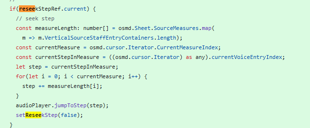

### **第十天（及后续）：跳转功能攻坚——当AI遇到“文档不足”的黑暗区域**

第十天及随后几天碎片化的开发，目标聚焦于一个极其实用但棘手的核心功能：**在乐谱播放中实现精准的跳转**。典型场景是孩子练习时，需要回退重弹某一段或跳过熟悉的段落。这个功能的实现过程，清晰地划分了AI辅助的边界，并最终由开发者亲自深入底层完成了关键整合。

**第一阶段：AI实现视觉跳转与“视听断层”的发现**

我们首先明确了需求：通过按钮实现向前/向后跳转一个音符、一个小节或一行。AI在此阶段表现高效。它熟练地调用OSMD库的API（如`cursor.next()`、`cursor.moveToMeasure()`），快速实现了**光标的视觉跳转**。按钮点击后，乐谱上的红色指示器能准确地移动到目标位置。

然而，一个根本性问题立刻暴露：**虽然光标移动了，但背景音乐仍从原先的位置继续播放**。我们遭遇了“视听断层”。在数轮的沟通中，AI反复检查光标移动代码、尝试不同的API调用，但始终无法解决问题。根本原因在于，AI的解决方案始终停留在它“可见”的层面——即OSMD的**图形渲染系统**。它没有意识到，在我们的项目中，**音频播放是由另一个独立的引擎（如`SoundFontPlayer`）驱动的**，两者在默认情况下并未同步。

**第二阶段：人工Debug与关键洞察——发现“跳转协议”**

当AI的尝试陷入循环后，我不得不亲自介入Debug。我系统地检查了OSMD实例和音频播放器实例的所有可用方法，最终在音频播放器对象上发现了关键函数：`.jumpToStep(stepNumber)`。

这个发现揭示了问题的本质：跳转不是一个单一操作，而是一个需要两步完成的**协议**：
1.  移动**视觉光标**（OSMD负责）。
2.  同步**音频播放进度**（需手动调用播放器的`jumpToStep`）。

AI之所以无法解决，是因为这个`jumpToStep`方法在通用教程和基础示例中很少被提及，属于更深度的集成API。**在缺乏丰富文档和样例的“黑暗区域”，AI的推理能力便迅速衰退**。

最终我动手写了一小段fix代码：

> 事实上测试发现在某些场景下这段代码的逻辑也有问题，我猜测可能是播放器与光标的音乐信息略有不一致导致的，我也缺乏音乐系统知识，所以暂时先将这个版本checkin，后续有时间再系统性解决一下。

**第三阶段：人工实现同步逻辑与战略简化**

我编写了AI未能产出的核心同步逻辑。这需要计算光标移动后的新位置（以`step`为单位的索引），然后显式地调用`audioPlayer.jumpToStep(newStep)`。其中，计算step索引涉及对乐谱结构的理解（例如，累计前面所有小节的step数），这进一步要求深入阅读库的源代码，完全超出了AI当前的能力范围。

同时，我做出了两项**战略性的简化决策**，并交由AI高效实现：
1.  **精简导航维度**：移除“前后音符”和“前后行”的跳转，**只保留最实用、最稳定的“前后小节”跳转**。这大幅降低了状态管理的复杂度。
2.  **限定操作状态**：规定**只能在音频暂停时进行跳转**，播放时禁用跳转按钮。这彻底避免了在播放过程中同步状态可能引发的竞态条件和音频错乱。

AI出色地完成了这两项界面和状态控制修改，使交互逻辑变得清晰、鲁棒。

**总结：成本、边界与决策**

1.  **AI的效率与成本**：在明确的、有文档支持的层面（如调用标准API修改UI），AI效率极高。我观察了一下实现移除“前后音符”和“前后行”的跳转，约消耗了价值**0.9元**的API调用成本，耗时大约10分钟，我觉得这个还是划算的，这10分钟我可以去打一杯咖啡或者看一封邮件。
2.  **AI的硬性边界**：当任务需要**理解未明确文档化的系统内部协议**、**进行需要领域知识的计算**（如乐谱step的累加）或**逆向工程组件关系**时，AI目前无法替代开发者的深度调试和源码阅读能力。
3.  **开发者的核心角色**：在这次攻坚中，我的角色从“需求提出者”转变为**“系统架构侦察兵”**和**“集成协议制定者”**。我先于AI发现了系统内部存在的“音频-视觉同步协议”，并制定了实现该协议的具体步骤和简化策略，再引导AI完成它擅长的部分。

至此，跳转功能以一种稳定、实用的方式得以实现。它虽然放弃了部分灵活性（如精确到音符），但获得了极高的操作确定性和用户体验的可靠性。这个过程再次验证，在Vibecoding中，最核心的价值往往来自于开发者对问题本质的洞察和在关键时刻做出的、赋予AI明确执行路径的简化决策。