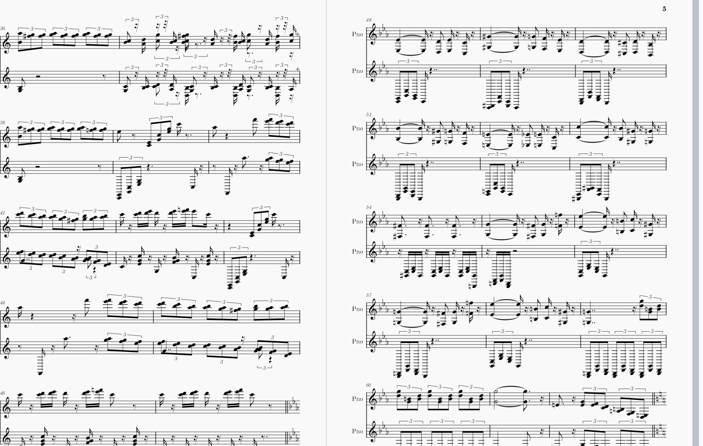

### **第二天：在资源的现实与工具的局限间，寻找最优路径**

第一天的尝试显然是一个完全的失败，但是也并不是一无所获。我注意到一些名字，比如`mxl` `musescore` `midi` 等。我查阅了一些资料，对这方面的领域知识有了一些简单的认知
- `mxl` 就是一个压缩包，里面会有一个xml文件记录着曲谱，所以很适合用来转换pdf，以及未来比对弹奏的乐曲是否正确。
- `mid` 是一个二进制文件，这个文件可以直接播放，也可以用过`musescore` 转换为`mxl`格式

**1. 资源调研：接受“中间格式”的现实**

我的第一项任务是摸清“货源”。理想情况下，我希望应用能直接处理最专业的 `MXL` 文件。但一番搜索后发现，互联网上大量流通的、易于获取的免费曲谱资源，往往是 `.mid`（MIDI）格式。相比之下，高质量的 `MXL` 文件则多集中在专业社区，我找到的一个网站，其费用高达500多元人民币。

面对这个现实，我迅速调整了策略。与其强求难以大量获取的 `MXL`，不如**接纳MIDI作为“原材料”**，并在我的应用中完成后续的精加工。这样一来，技术目标便明确了：**构建一个能够接收MIDI文件，并自动将其转换为可打印的PDF乐谱的Web工具。**

**2. 技术验证：首次构建完整的转换流水线**

我与DeepSeek协作，确定了首个技术方案：一个三步走的转换流水线 `MIDI -> MXL -> PDF`，并再次启动Vibecoding。Claude Code生成了一个基于 **Python Flask** 的应用，它忠实地实现了这个逻辑：上传MIDI后，使用 `music21` 库将其解析并转换为MXL，再调用另一个库尝试将MXL渲染为PDF。

从概念和流程上看，它无懈可击。然而，当我用真实的MIDI文件测试时，生成的PDF质量却令人失望。音符的间距和布局显得生硬、机械，整体排版透着一股“计算机生成”的粗糙感。这次尝试证明，依赖通用的Python库，只能得到一个**流程正确但结果不达标的“玩具”**。

最初版本的界面长下面的样子：

产生的曲谱非常怪异：

**3. 关键破局：从“线索”到“决策”的主动探索**

在沟通如何提升质量时，DeepSeek提及了 **MuseScore 可能具备命令行功能** 作为一个潜在信息点。它并未给出完整方案，但这对我来说已经足够了——这就像一个关键线索。

我打开终端，直接测试了命令：`mscore -o 输出.pdf 输入.mid`
结果令人振奋：MuseScore这个专业软件，仅用一行命令就生成了排版精美、堪比出版级的PDF。它完美绕过了此前流水线中所有脆弱的人工解析和渲染环节。

此刻，一个清晰的、由我主导的技术决策形成了：**放弃在通用Python库中挣扎，将核心转换工作委托给MuseScore这个“专家”。** 我随即停止了漫无目的的追问，转而向Claude Code下达了明确的构建指令：**“重写应用的后台逻辑，使其能调用MuseScore命令行工具来完成从MIDI到PDF的转换。”**

**小结：**
第二天是从被动接受到主动探索的转折点。它始于对资源现状的妥协（接受MIDI），经历了对自建技术方案的失望。真正的突破点在于：**我从AI提供的一个零星线索出发，通过自己的快速验证，形成了一个关键的技术洞察，并果断地以此为依据，指挥AI调整了实现方向。** 这个过程让我体会到，在Vibecoding中，**开发者最重要的角色之一是成为“技术验证者”和“决策指挥官”**。AI是信息与代码的庞大素材库，但发现价值的线索、验证方案的可行性，并最终拍板技术路线，这些创造性的决断力，依然牢牢掌握在人的手中。