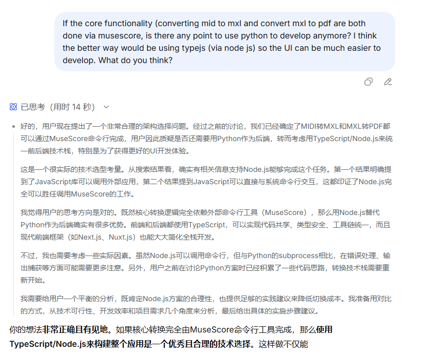
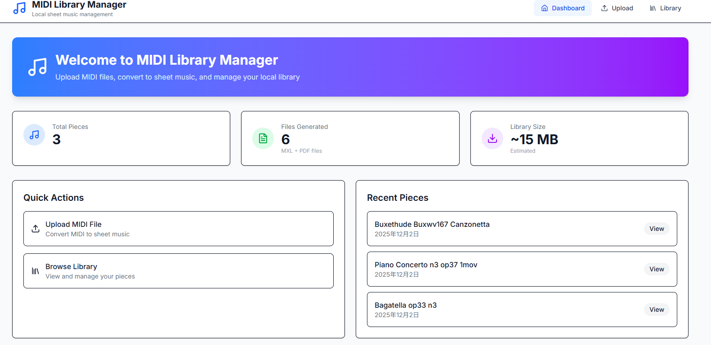
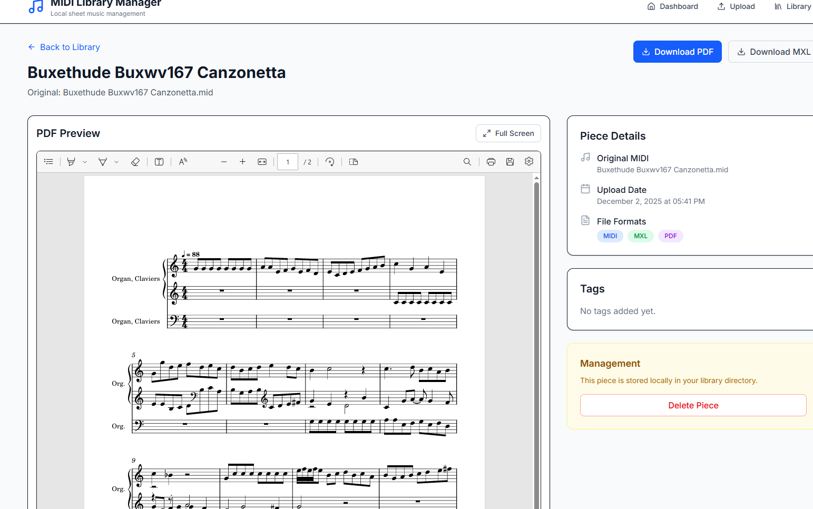

### **第三天：架构的顿悟——当“工具思维”升维为“系统思维”**

第二天晚上，当我在测试MuseScore命令行那完美的转换效果时，一个此前被忽略的问题，突然在脑海里清晰起来，像是一道关键的函数被调用执行：

**“等一下，既然最核心、最复杂的乐谱渲染工作已经外包给了 `musescore.exe` 这个专业的二进制工具，那么我的后端代码还剩下什么？它不过是一个接收文件、调用命令行、再管理一下文件路径的‘协调员’而已。”**

这个简单的认知，引发了一场架构上的地震。我审视着第二天用Python Flask搭建的那个版本——我为什么还需要python呢？为了一个本质上只是“文件搬运+系统调用”的简单后端逻辑，引入整个Python栈，这无异于**用高射炮打蚊子**，或者用**水果刀来宰牛**。

那一刻，一个更优雅的方案几乎是自然而然地从脑海里蹦了出来：**“为什么不直接用TypeScript/Node.js来开发呢？”**

**1. 与技术伙伴的“决策对谈”**

第三天一早，我并没有急着写新的Prompt，因为我意识到这个prompt已经比较复杂了。我是一个很懒惰的的人，不喜欢编写长篇的文字。因此我带着这个架构设想，与我的技术伙伴DeepSeek展开了一场“决策对谈”。这不再是第一天的需求澄清，也不是第二天的方案验证，而是一次**基于技术洞察的可行性论证**。

我向DeepSeek阐述了我的核心逻辑：
- **前提**：核心转换由独立CLI工具完成。
- **推论**：后端逻辑极简（文件操作与子进程调用）。
- **判断**：Node.js的`fs`和`child_process`模块原生、高效地支持这些操作。
- **优势**：与前端共享TypeScript语言、工具链和npm生态，彻底消除上下文切换成本。

DeepSeek迅速领会并完全赞同了这个分析。它补充道，对于此类工具型应用，使用像**Next.js**这样的全栈框架将是绝佳选择，它能将文件上传、API路由和页面渲染无缝地整合在同一个项目中。

**2. 从“想法”到“蓝图”：Prompt的质变**

至此，最关键的一步到来了。我并没有让Claude Code直接开始写代码，而是**首先让DeepSeek将我们刚才讨论形成的完整技术架构，转化成一个极其详尽、约束明确的Prompt**。这个Prompt与第一天那个功能性的描述有着天壤之别。Deepseek生成的prompt可以参见repo根目录下的init.md的前半部分（到Prompt1 为止）

这个Prompt本身，就是一份高质量的**迷你技术设计文档**。它是我作为开发者，将前两天探索获得的认知（MXL、MuseScore CLI、质量要求）与新的架构洞察（全栈TypeScript）进行综合后，产出的最关键交付物。人的技术判断在这里起到了决定性作用：**AI不再是盲目的探索者，而是拥有了精确蓝图的执行者。**

**3. 效率的飞跃：生成即可用**

当我把这份凝聚了全部思考的Prompt交给Claude Code时，结果令人振奋。它生成出的不再是一个需要大改的“原型”，而是一个**几乎开箱即用**的Next.js应用。

- **架构清晰性**：`pages/api/` 下的API路由处理上传和转换，`pages/library/` 下的页面展示结果，逻辑分离得天衣无缝。
- **开发体验**：前后端共享类型定义，修改API接口时前端调用处立刻能检测到类型错误，这种一致性带来了巨大的心智舒适感。
- **功能完成度**：上传、调用MuseScore、存储、列表展示、PDF预览……所有核心流程一气呵成。生成的UI简洁现代，完全超出了对一个自动化工具的期待。

主体dashboard页面：

曲谱预览页面：

**小结：认知的杠杆效应**
第三天，项目完成了一次漂亮的“架构跃迁”。其成功并非来自盲目的尝试，而是源于一个**基于技术本质的洞察**（后端逻辑的简化），以及一次**将洞察转化为机器可精确执行的指令**的沟通过程。

它证明了，在Vibecoding中，开发者最重要的价值或许不是亲手编写每一行代码，而是：
1.  **在关键节点做出正确的技术判断**（从Python到全栈TS）。
2.  **将模糊的“好想法”提炼成结构化的“好问题”或“好约束”**（生成那个高质量的Prompt）。

AI在这一天扮演了**卓越的“首席实现官”**角色，而我将自己定位为**“架构师兼产品经理”**。当我们各自发挥所长时，生产力便发生了指数级的提升。这个小小的钢琴谱应用，就此从一个实验品，蜕变成了一个拥有坚实技术底座、可维护、可扩展的真正项目。
