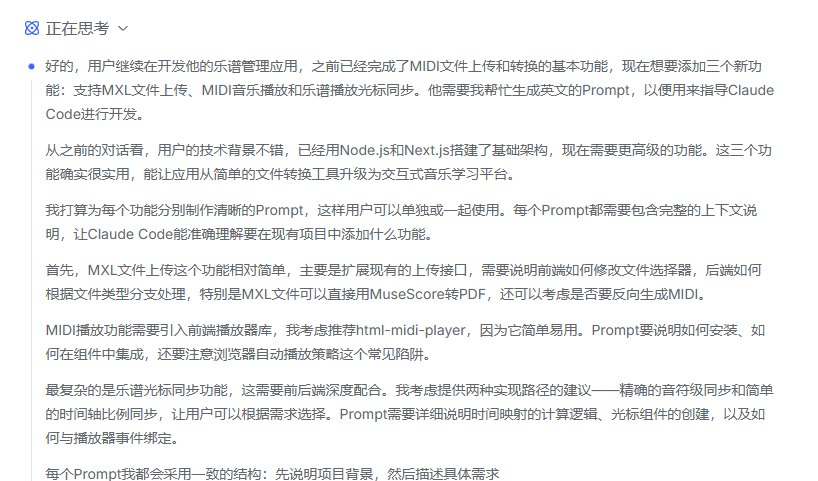

### **第四天：在成功修复与受挫探索间的成本反思**

第四天的工作，始于一个明确的技术债，止于一次代价不菲的探索，让我对AI协作的“成本边界”有了切身体会。

**1. 目标一：解决Android平板PDF预览问题 —— 一次高效的合作攻关**

前一天我发现了Android兼容性问题，pdf谱曲在PC和Ipad上都可以正常预览，但是Android平板（华为）上并不兼容。因此我向Claude Code提出了需求，要他解决安卓平板播放的兼容性问题。

这个问题它解决得还是挺好的，没几下平板上的播放问题就搞定了。

**2. 目标二：集成MIDI播放功能 —— 陷入“成本黑洞”的探索**

相比之下，第二个目标——“为曲谱添加MIDI播放功能”——则成了一场持久且昂贵的拉锯战，并且**最终未能成功**。

我的初衷很自然：既然应用已经管理着MIDI文件，让它们能发声将极大提升交互性。我按照经典的Vibecoding流程启动：与DeepSeek讨论技术选型（如`Tone.js`, `MIDI.js`等），生成集成代码，然后运行测试。

然而，我们迅速撞上了一堵“依赖之墙”。无论选择哪个库，总会在安装、导入或运行时出现令人费解的兼容性错误。很遗憾当时我没有截图保存错误现场。

为了“调试”这个由AI生成的、我自身也不熟悉的技术栈，我不得不开启了一场与DeepSeek的“追问循环”：粘贴一段报错，等待它分析并给出调整建议（通常涉及降级、换库或修改导入方式），我再去执行，然后遇到新的报错，再继续提问……

**我眼睁睁看着DeepSeek API的调用费用快速攀升，但项目中的MIDI播放器却从未成功发出过一个音符。** 每一次调用都在为“试错”买单，但并没有逼近一个稳定的解决方案。我最终暂停了这个任务，打算第二天尝试一下Codex模型和Sonnet模型是否可以解决这个问题。

