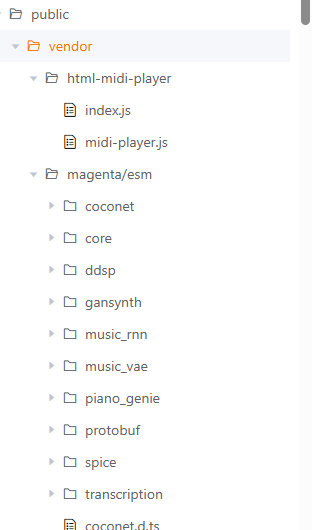

### **第五天：迂回战术的胜利与“按下葫芦浮起瓢”的新挑战**

第五天是一场典型的“迂回战”。当正面强攻（调试复杂的前端音频库）一再受挫后，我转变思路，最终找到了突破口，但也立刻面临了技术债的反弹和功能局限的显现。

**1. 强攻受挫：更换“大脑”并未改变战局**
在经历了第四天高昂的试错成本后（Deepseek API调用成本已经达到了20多元），我尝试更换AI模型，先后使用了**Codex**和**Claude Sonnet**作为后端，希望新的“思考方式”能破解集成难题。然而，尽管沟通数小时，问题依旧卡在复杂的npm包依赖和Web Audio API的兼容性上。我意识到，在脆弱且不熟悉的生态中进行深度集成，无论换哪个模型，都难以绕过需要手动精准调试的深水区。

> Codex和Claude Sonnet当然比Deepseek更贵，国内也没有办法正常接入。我是因为工作原因有访问途径，而且不需要额外付费。

**2. 迂回破局：复制“活的样本”并成功集成**
我决定彻底改变策略，首先**找一个已经确定能工作的“样本”，让AI去复制和适配它**。

我直接验证了 `html-midi-player` [官网](https://cifkao.github.io/html-midi-player/)的纯HTML演示页面，确认它能完美播放MIDI。于是，我给Claude Code下达了一个清晰的指令：**“参照官网demo，生成一个能播放指定URL的MIDI文件的静态HTML页面。”** 它迅速生成了一个 `midi-visualizer-test.html` 文件。

**关键一步出现了**：当Claude Code将这个文件放入Next.js的 `public` 目录并配置后，它**自主地、正确地处理了所有路径和资源引用**。我原本准备应对的跨域问题，在它构建的这次部署方案中根本没有出现——静态页面与主应用API同源，天然地、无障碍地访问到了服务器上的MIDI文件。过程中虽有一次路径配置报错，但在我提供错误信息后，Claude Code便迅速修正了。

这个代码非常简单，所以我直接贴在这里
```html
<body>
  <div class="container">
    <header>
      <h1>MIDI Visualizer Local Test</h1>
      <p class="note">This page uses html-midi-player's <code>midi-visualizer</code> with a local MIDI file from the library folder.</p>
    </header>
   
    <midi-player
  src="/api/download?pieceId=c67ea4a5-3b65-431b-b15a-032da61575c9&type=mid&download=true" 
  sound-font visualizer="#myStaffVisualizer">
</midi-player>

    <p class="note" style="margin-top:12px;">If audio does not start, click within the page first to allow audio playback.</p>

    <p style="margin-top:24px;">For more information, see the
      <a href="https://github.com/cifkao/html-midi-player" target="_blank"><strong>html-midi-player</strong> repository</a> on GitHub.</p>
  </div>

  <!-- Scripts from the example -->
  <script src="https://cdn.jsdelivr.net/combine/npm/tone@14.7.58,npm/@magenta/music@1.23.1/es6/core.js,npm/focus-visible@5,npm/html-midi-player@1.5.0"></script>

  <!-- Connect visualizers to the built-in player -->
  <script>
    const player = document.getElementById('player');
    const staffVis = document.getElementById('myStaffVisualizer');
    const rollVis = document.getElementById('myRollVisualizer');

    // html-midi-player exposes addVisualizer on the player element
    player.addVisualizer(staffVis, { scrollType: 'continuous' });
    player.addVisualizer(rollVis, { scrollType: 'continuous' });
  </script>
</body>
</html>
```

**3. 从静态页到组件：清晰的“参照实现”指令**
静态页面成功了，但我们需要将其融合到应用中。我没有让它自由发挥，而是给出了一个非常具体的、基于成果的指令：**“请参照这个`midi-visualizer-test.html`文件的实现逻辑，在我的Next.js项目里，创建一个React组件，实现完全相同的播放功能。”**

这是一个“依葫芦画瓢”的任务，Claude Code完成得非常出色。**困扰数日的播放功能，通过这种“复制-迁移”的曲线路径，终于稳定地实现了。**

**4. 胜利的代价**
然而，事情并没有那么简单：
*   **兼容性回归**：为解决播放问题而引入的新前端资源，很可能**影响甚至抵消了之前为Android平板PDF预览所做的兼容性优化**。移动端兼容像一个动态平衡，一处改动常引发另一处问题。
*   **功能局限**：`html-midi-player`自带的“光条”跟随功能，在面对复杂曲谱时同步效果不佳，经常错位。这说明，**一个为演示优化的“开箱即用”功能，难以满足真实、复杂的专业需求**。我们得到了基础播放能力，但距“精准的演奏跟随”这一目标还很远。
*   **代码问题**：我发现这一次的PR有上百个文件改动，检查之后发现`public/vendor`下有大量的代码，我的理解应该是没有用到这些的。我猜测可能是之前迭代过程中引入的未使用的代码
  


**小结：样本的力量与集成的艺术**
第五天的核心经验是：
1.  **用成品驱动开发**：当在未知领域集成受阻时，寻找一个**最小可工作样本**，并让AI执行“复制-适配”，是最高效的破局方法。这比从零开始的抽象描述要可靠得多。
2.  **明确指令基于成果**：在AI已经产出可行成果（静态页）后，指令应转变为 **“请参照X，实现Y”** 。这能将其思维牢牢锁定在已验证的路径上，避免再次偏航。
3.  **功能具有层次性**：“播放声音”是基础功能，可通过复制样本解决；“与乐谱精确同步”则是高阶功能，需要定制化开发。后者无法简单复制，提示我们下一个攻坚模块的复杂性。
