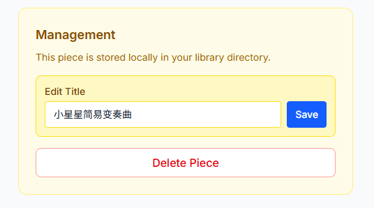

### **第六天：修复、打磨与警惕AI的“表面功夫”**

第六天的工作，是一个典型的软件维护与迭代日。核心不是开拓新功能，而是**修复引入的缺陷、优化已有体验，并在与AI的协作中，保持对实现细节的深度警觉。**

**1. 精准溯源与“时光倒流”：修复Android兼容性回归**

第五天虽然成功集成了播放器，但也带来了Android平板PDF预览的兼容性“回退”。我没有立即开始修补，而是**首先查看了Git提交历史**。通过仔细比对，我发现问题并非由最终的静态页面方案导致，而是源于**更早一次不成功的、尝试直接集成播放库的提交**。那次提交引入了大量冗余依赖和配置，污染了项目环境。

诊断明确后，我给Claude Code下达了最直接的指令：**“请帮我将项目状态回退（revert）到那个有问题的提交之前。”** 这个操作就像一次精确的“时光倒流”，清除了所有因错误尝试而产生的“技术负债”，让代码库恢复到一个干净的状态。

接着，我**清晰地重复了第五天被验证有效的“两步走”指令**：
1.  “将之前生成的可工作的 `player.html` 静态页面，放入 `public` 目录。”
2.  “参照这个静态页面的实现，在Next.js中创建一个功能相同的React播放器组件。”

这一次，Claude Code心无旁骛，完美地完成了任务。Android平板的预览功能也随之恢复正常。这件事强化了一个关键认知：**在AI协作中，保持代码库的整洁和可回溯性至关重要。一旦发现污染，应果断重置到已知的干净状态，而不是在错误的基础上打补丁。**

**2. 本土化适配：绕过“404”的CDN依赖墙**

功能集成后，在本地测试中，一个新的现实问题浮出水面：播放器组件依赖的一个JavaScript库，其引用的海外CDN地址在国内网络环境下无法访问，导致功能直接瘫痪。

面对这个环境问题，我采取了最务实的解决方案。我没有让AI去寻找替代CDN（这可能再次引入不确定性），而是**手动将该JS库文件下载到本地**，放置在 `public/vendor/` 目录下，并指示Claude Code修改组件中的引用路径，从远程CDN指向本地 `/vendor/` 路径。

这个小小的改动，相当于为应用建立了一个**稳定的、离线的核心资源仓库**，彻底消除了因外部网络环境导致的功能风险。它提醒我们，AI生成的方案往往是“全球通用”的理想版，而真正的部署需要开发者结合本地环境进行**必要的“本土化”适配**。

**3. 功能打磨与“记忆陷阱”：发现并修正持久化漏洞**

基础稳定后，我开始进行体验打磨。我与Claude Code进行了多轮快速对话，指示它调整UI文字、优化布局，并新增一个“曲谱重命名”功能。

这些优化点，AI都完成得很快，界面也立刻变得美观了些。重命名功能在UI上看起来一切正常：点击编辑、输入新名字、保存，列表即时更新。

然而，在一次偶然的页面刷新后，我发现刚刚改好的名字**变回了原样**。我立刻意识到问题所在：Claude Code实现的只是“前端状态更新”，并没有将新名字**持久化保存到后端文件或数据库**。它只改变了浏览器内存里的数据，而没有触动磁盘上的 `meta.json` 等配置文件。

我随即向Claude Code指出了这个缺陷：“重命名操作没有持久化，刷新后丢失。” 它迅速理解了问题，并给出了修正版本，在重命名函数中补充了向后台API发送请求、更新元数据文件的逻辑。

**小结：从“功能可用”到“代码可靠”的警觉**
第六天看似平淡，却充满了值得深思的细节：
1.  **状态管理优于盲目修改**：当项目出现问题时，**先溯源，再重置**，比盲目调试更高效。利用好版本控制工具，是与AI协作的“安全网”。Git非常重要，当AI完成一项功能后及时回滚，当它无法解决问题时，**立即回滚**，而不是在错误代码上打补丁。
2.  **永远质疑AI的“表面完成”**：AI擅长快速生成“看起来没问题”的代码，但对于数据流、状态持久化、错误边界等深层次逻辑，它容易留下漏洞。**我们必须以用户的完整操作流程（如“刷新页面”）去测试每一个功能**，验证其是否真的“完成”，而不仅仅是“呈现”。

经过这一天，应用不仅功能更加完善，其代码基础和我的协作方式也变得更加稳健。我不再只是功能的“索取者”，更是项目状态的“审计员”和实现深度的“验收官”。