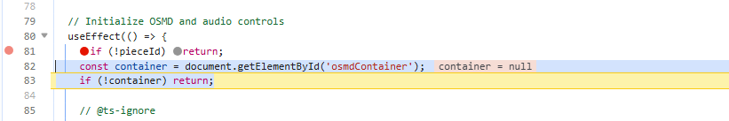
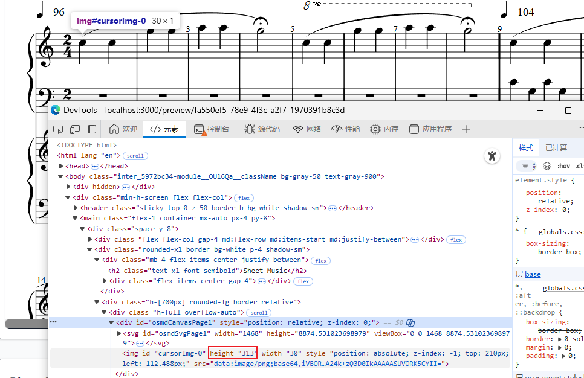
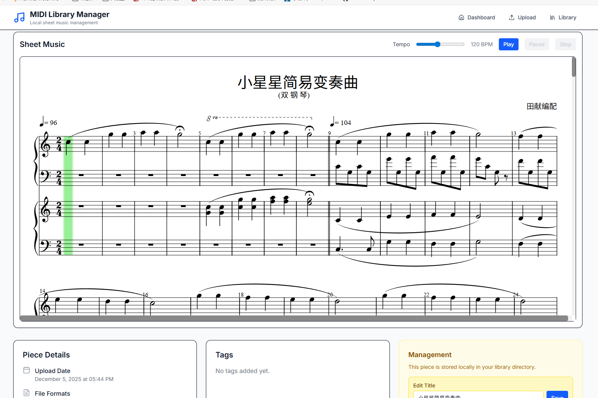

### **第七-八天：集成专业乐谱渲染器——当AI的“理想组件”遇到现实的路由问题**

在实现了基础的MIDI播放后，项目的下一个自然跃升，是让乐谱**动起来**——即在播放时，有一个可视的光标在乐谱上精确移动，创造真正的跟随练习体验。经过与LLM的几番交流，我了解到一个专业的开源库：**OpenSheetMusicDisplay（OSMD）**。它不仅能渲染漂亮的乐谱，更原生支持与音频播放器同步，是实现光标功能的理想选择。

**1. 遵循成功模式：先验证，后集成**
有了之前集成播放器的经验，我深知直接让AI在复杂项目中引入新库风险极高。因此，我再次采用了被验证有效的“**样本先行**”策略。我让Claude Code首先在 `public` 目录下创建了一个独立的 `osmd-demo.html` 静态页面，其唯一任务就是验证：OSMD能否成功加载我服务器上的MXL文件并渲染出乐谱？这个最小化验证很快获得了成功，证明了OSMD库本身与我们的文件兼容。

**2. 集成遇阻：AI的合理猜测与人类的最终裁决**
当将验证成功的代码集成到Next.js应用页面时，问题出现了：乐谱渲染区域一片空白。AI助手开始了它的调试循环，它基于常见的Web开发经验提出了各种假设，各种迭代，但是没有很好的突破。最终我看了以下代码之后回忆起一个之前遇到过的问题，在React中按照element id去查找的时候经常会不成功，有一套标准的解法（useRef）。将这些提示词给到后，第一个问题顺利解决，使用public目录下的test.mxl可以正常渲染。下图可以看到问题。



但是解决这个之后，我仍然没有办法渲染出除了这个静态测试文件之外的其他mxl文件。在经过几轮LLM自己的迭代后，没有很好的解决。于是我不得不再次接手。经过一段时间的调试和猜测后，我突然有了一个非常“不可思议”的假设，会不会“是OSMD对文件URL的后缀名有严格要求，必须是 `.mxl` 结尾？”如是我决定让Claude Code去编写一个API，它能应对`api/mxl/xxx.mxl`这样的Get请求，并返回正确的文件内容。这样一改之后，顿时就好了。

**3. 第八天：征服“隐形”的光标——CSS战争与交互打磨**

解决了渲染问题后，我们迎来了核心目标：让光标在播放时移动。然而，新的怪象出现了：音乐播放正常，但那个期待中的光标却**彻底隐形**。

样式深渊：当两个框架的规则在暗中打架**

Claude Code（此时我已经用上了号称最能打的Opus 4.5模型）进行了若干次尝试之后，不能说是一无所获吧，只能说是啥用没有。没办法，这一轮的第三次接收来了。

我打开了浏览器的开发者工具，开始了“法医”式的检查。我很快发现，OSDM的光标其实就是一个小图片，在播放音乐过程中这个图片的位置会被不断调整。OSDM试图设置高度为313但是并没有生效，其实际高度只有1px因此看不到。



仔细检查css样式后，我发现了问题之所在：项目中使用了Tailwind CSS，在其基础样式（`Preflight`）中，为了保持响应式，为所有 `img` 等元素设置了 `max-width: 100%` 和 `height: auto`。而OSMD内部使用SVG和Canvas渲染，其复杂的嵌套元素也应用了自身的尺寸控制。这两套规则的**意外叠加**，导致承载光标的容器元素被计算为仅有1像素高，从而让光标“消失”了。

这是一个极其细微且情境化的前端问题，AI几乎不可能从代码逻辑中直接推理出来。

发现问题之后让AI去解决就很容易了，它很快找到了一个解决方案，强制撤销了Tailwind CSS的 `height: auto` 样式。

```
<style jsx global>{`
  @layer base {
  img,
  video {
    height: revert-layer !important;
    }
  }
`}</style>
```

至此，主要的功能完成。我又让Claude Code做做了一些页面的小调整，比如按钮的位置、页面布局等（现在我将曲谱单独占一整行，其他的组件都放到下面去了）。与第六天一样，这些功能AI都完成得很好。总体来说，我还是认为，完全没有技术背景的人想要纯依靠AI搭建一个相对复杂的项目，还是很困难的。就我这两天解决的这三个问题，完全没有技术背景的话，还是很难指导AI走出来的。但是毫无疑问，对于我，一个有10年开发经验，大约3年前端经验的人来说，我之前也绝不敢想象我能用8天的带娃空余的时间去完成这样的一个原型项目。


到目前为止的主页面：

